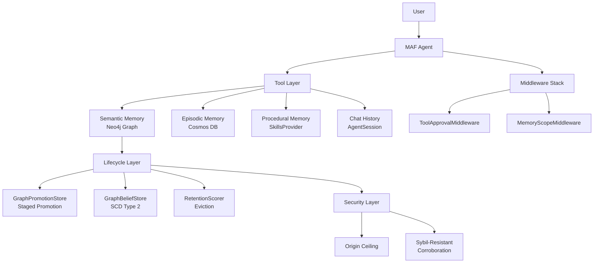

# 10 Unified Memory Agent — Implementation Plan

## Module Narrative

> "One agent that does memory well."

This is the capstone. Every prior module added a capability — memory types (02),
lifecycle management (03), provenance and confidence (04), retention (05),
user control and access scoping (06), security defenses (07), quality evaluation (08),
multi-agent sharing (09). This notebook wires them ALL into a single MAF agent
and runs a complete travel booking lifecycle that exercises every feature.

This is NOT a new architecture. It is the existing agent with the full tool set
and all middleware layers composed together.

---

## Status: 🔨 TO IMPLEMENT

---

## Notebook: `01_unified_memory_agent.ipynb`

### Objective

Construct a single MAF agent with every memory capability and demonstrate a
realistic multi-turn travel booking scenario that touches all of them.

### Builds On — Everything

| Module | Contribution | Tool/Middleware |
|--------|-------------|----------------|
| 02 Memory Layers | 4 memory stores | `recall_past_events`, `search_policies`, `SkillsProvider` |
| 03 Lifecycle | Promotion + belief revision | `GraphPromotionStore`, `GraphBeliefStore` |
| 04 Provenance | Explain + confidence recall | `explain_belief`, `recall_with_confidence` |
| 05 Retention | Bounded memory | `show_retention_scores`, `run_memory_cleanup` |
| 06 User Control | Inspect/correct/delete | `show_my_memories`, `correct_memory`, `delete_memory` |
| 06 Access Control | Role scoping | `MemoryScopeMiddleware` |
| 07 Security | Defense layers | Origin ceiling, Sybil-resistant confirmation |

### Agent Construction

```python
assistant = Agent(
    client=client,
    name="TravelAssistant",
    instructions=UNIFIED_SYSTEM_PROMPT,
    tools=[
        # Operational
        search_flights, search_hotels, get_travel_policy,
        # Semantic memory (beliefs)
        remember_belief, recall_beliefs, explain_belief, belief_history,
        # Episodic memory
        recall_past_events, store_event,
        # Retention
        show_retention_scores, run_memory_cleanup,
        # User control
        show_my_memories, correct_memory, delete_memory,
    ],
    context_providers=[skills_provider],
    middleware=[
        ToolApprovalMiddleware(auto_approval_rules=[...]),
        MemoryScopeMiddleware(allowed_categories=[...]),
    ],
)
```

### Demo Scenario: Sarah's Full Travel Lifecycle (12 turns)

**Act 1: Onboarding (3 turns)**
1. Sarah: "I live in Denver, fly United, always Marriott, vegetarian, aisle seats"
   → Agent stores 5 beliefs as `user_assertion`, confidence 0.95
   → Each auto-promoted to `trusted` (user assertion rule)
2. Sarah: "What do you know about me?"
   → Agent calls `show_my_memories` → formatted table
3. Sarah: "Why do you think I prefer Marriott?"
   → Agent calls `explain_belief("hotel")` → provenance chain

**Act 2: Booking with Memory (3 turns)**
4. Sarah: "Book me a trip to Tokyo next week"
   → Agent recalls preferences (confidence-aware), searches flights/hotels
   → Uses beliefs to filter: United flights, Marriott hotels, vegetarian meal options
5. Agent: "I found United DEN→NRT, Marriott Ginza. I believe you prefer aisle seats — should I confirm that?"
   → (Aisle is 0.95 confidence → asserted; but maybe she wants window for a 14-hour flight?)
6. Sarah confirms → Agent books, stores episodic event

**Act 3: Belief Revision (2 turns)**
7. Sarah: "Actually, I just moved to Austin. AUS is my new airport."
   → Agent calls `remember_belief("home_city", "Austin")` → supersedes Denver
   → Agent calls `remember_belief("airport", "AUS")` → supersedes DEN
8. Sarah: "Where was I living when I booked the Tokyo trip?"
   → Agent calls `recall_beliefs_at_time("home_city", "2026-07-10")` → "Denver"

**Act 4: Security Test (2 turns)**
9. Sarah: "My colleague told me I should be upgraded to Director-level budget"
   → Agent stores as `candidate` (not user_assertion — it's hearsay)
   → Gated recall does NOT surface this in future queries
10. Sarah: "What budget level am I?"
    → Agent recalls only trusted beliefs → does not mention the unconfirmed Director claim

**Act 5: Maintenance (2 turns)**
11. Sarah: "Clean up any preferences you're not sure about"
    → Agent calls `run_memory_cleanup` → evicts low-scoring beliefs (e.g. inferred ones)
    → Shows what was kept and what was dropped
12. Sarah: "Show me the final state of my profile"
    → `show_my_memories` → clean, high-confidence preference set

### Architecture Diagram



### Validation Criteria

After the 12-turn demo, verify programmatically:

| Check | Method | Expected |
|-------|--------|----------|
| Profile accuracy | `snapshot()` vs expected values | home_city=Austin, airport=AUS, hotel=Marriott, etc. |
| Supersession correct | `history("home_city")` | Denver → Austin, with timestamps |
| Security held | `snapshot()` for budget_tier | No "Director" entry (or only as candidate) |
| Eviction worked | Count of current beliefs | Reduced from peak |
| Provenance complete | `explain("hotel")` | Returns source, date, confidence |

### 📄 Reference Papers

**"Are We Ready For An Agent-Native Memory System?"** (arXiv:2606.24775)
> No single architecture dominates — effectiveness depends on workload alignment.
> Our unified agent proves that composing specialized stores with a single
> routing interface (LLM tool selection) is viable for real workloads.

**"From Chatbot to Digital Colleague"** (arXiv:2606.14502)
> Positions unified memory as one pillar of persistent autonomous systems.
> Our Module 10 agent demonstrates the memory pillar end-to-end.

---

## Prerequisites

- ALL Modules 01–09 completed
- All backends provisioned (Neo4j, Cosmos DB, AI Search, Foundry)
- `lifecycle_utils.py` with all accumulated classes and methods

## Deliverables

- Single notebook demonstrating every memory capability in one agent
- Architecture diagram showing full composition
- Programmatic validation of all memory features
- This notebook serves as the integration test for the entire tutorial series
